 

# Hey! Nice to see you.

Welcome to my page!
I'm Tushar, Software Engineer from Bengaluru, Karnataka, India.
 

## 🛠 What I Work With

**Languages**

**Frontend**

**Backend**

**Databases**

**DevOps & Cloud**

**AI & Data**

**Tools & Platforms**

 

## 🔭 Currently
- 🏗 &nbsp; Building &nbsp;**[Your Current Project]**
- 🌱 &nbsp; Learning &nbsp;**[What You're Studying]**
- 💬 &nbsp; Ask me about &nbsp;**[Your Expertise]**
- ⚡ &nbsp; Fun fact: &nbsp;**[Something Interesting About You]**
 

## 📬 Find Me
[]

 

---
*Stay curious. Keep shipping.* 🚀
